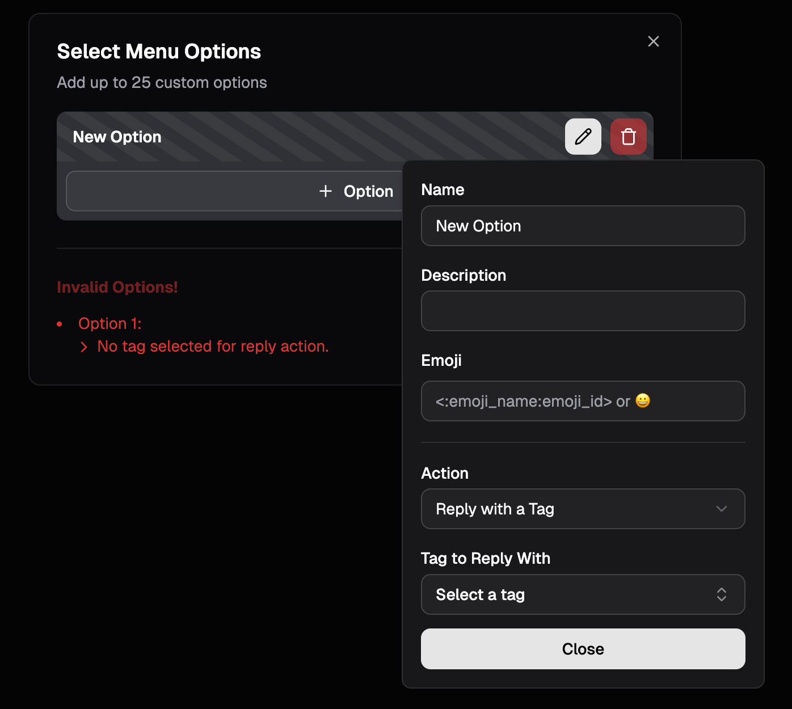

import { Card, CardGrid, Aside } from "@astrojs/starlight/components";
import ImageWrapper from "../../../components/ImageWrapper.astro";

Discord's Message Components V2 allow you to build rich, interactive messages with complex layouts. This guide provides a quick reference for all available components.

## Layout Components

Layout components help you organize and structure your message content.

<CardGrid>
  <Card title="Action Row" icon="list-format">
    A container for a row of interactive components. It can hold up to **5 buttons** or a **single
    select menu**.
  </Card>
  <Card title="Section" icon="comment-alt">
    Displays text content alongside an "accessory" component (a button or thumbnail).
  </Card>
  <Card title="Container" icon="document">
    Visually groups a set of components together, with an optional colored accent bar on the side.
    It basically looks like an embed, but doesn't have the same fields. It can also be spoilered.
  </Card>
  <Card title="Separator" icon="bars">
    Adds vertical spacing and an optional visual divider line between other components.
  </Card>
</CardGrid>

## Content Components

Content components are used to display static information like text, images, and files.

<CardGrid stagger>
  <Card title="Text Display" icon="seti:default">
    Displays **Markdown-formatted text**, similar to a standard message.
  </Card>
  <Card title="Media Gallery" icon="pnpm">
    Displays a gallery of **1-10 images** or other media items in an organized grid. Media items can
    be spoilered.
  </Card>
  <Card title="Thumbnail" icon="seti:image">
    A **small image**, used as an accessory in a `Section` component. It can be spoilered.
  </Card>
</CardGrid>

## Interactive Components

These components allow users to interact with the bot. With the exception of buttons used as a section accessory, all interactive components must be placed within an **Action Row**.

### Buttons

Buttons trigger actions when clicked. They must be placed in an **Action Row** or used as an accessory in a **Section**.

Buttons in SupportMail can have different actions:

1. **Link**: Opens a URL in the user's browser.
2. **Start Ticket**: Starts the ticket creation process - optionally for a specific category.
3. **Reply**: Responds with a [tag](/configuration/tags/) of your choice. This reply is only visible to the user who clicked the button.

### Select Menu

A Select Menu can hold up to 25 custom options. A user can only select one option at a time.  
When editing select menu options errors will be displayed and invalid options will be highlighted with a striped background.

A select menu option can have two types of actions:

1. **Start Ticket**: Starts the ticket creation process - optionally for a specific category.
2. **Reply**: Responds with a [tag](/configuration/tags/) of your choice. This reply is only visible to the user who clicked the option.

<ImageWrapper></ImageWrapper>

## The Panel Editor

## Form Components

Components V2 also bring along new components for forms (modals). SupportMail's forms support the following components:

- Text Inputs
- String Select Menus (dropdowns)
- File Uploads

This allows for much more interactive and dynamic forms compared to the previous version. Discord continues to expand the capabilities of modal components,
however it usually takes a few weeks for the library used to build SupportMail (discord.js) to support new features after Discord releases them.
Since discord.js also usually has bugs, new features may take longer to be usable in SupportMail.

<Aside type="note">
  Discord is currently working on adding support for checkboxes and radio buttons in forms 👀
</Aside>

---

## FAQ

Can I mix and match components from V1 and V2?

No. SupportMail uses Components V2 for its messages usually. There are only a few exceptions where regular embeds are used. However, you have to decide for one - you can't have both on the same message.
It's either **content + embeds + action rows** or **components V2 only**.

Where can I find more information about Discord's Message Components V2?

You can refer to the official Discord documentation on [Message Components](https://discord.com/developers/docs/interactions/message-components) for detailed information about each component type, their properties, and usage guidelines.

However, this is a developer-focused resource, and may not be very user-friendly for non-developers.

